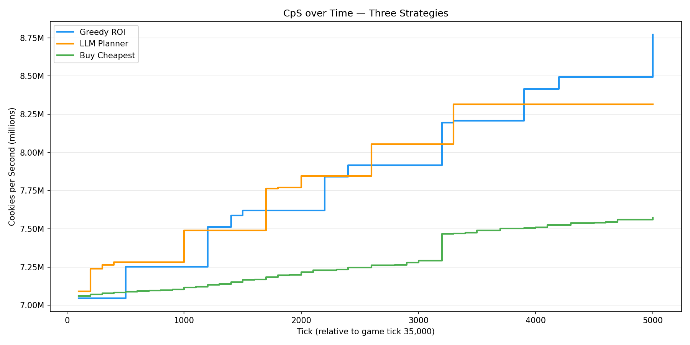

# cookie-clicker-strategy-lab

A Cookie Clicker simulation engine in Python that compares four purchase strategies: Buy Cheapest (baseline), Greedy ROI (algorithmic), LLM Planner (GPT-5-mini), and Hybrid (LLM planning + greedy execution). All running from the same mid-game starting state for 5,000 ticks.

## How to run

```bash
uv sync
cp .env.example .env                  # add your OPENAI_API_KEY
uv run main.py run greedy             # or: cheapest, llm, hybrid
uv run main.py visualize              # regenerate charts
```

## Results

5,000-tick run from the same mid-game checkpoint (tick 35,000):

| Strategy     | Final CpS  | Purchases | Upgrades | LLM Calls |
|--------------|------------|-----------|----------|-----------|
| **Hybrid** | **8,911,796** | **30** | **1** | **2** |
| Greedy ROI   | 8,771,218  | 27        | 0        | 0         |
| LLM Planner  | 8,314,442  | 42        | 1        | 5         |
| Buy Cheapest | 7,573,220  | 177       | 2        | 0         |




## Strategies
 
**Buy Cheapest** — baseline.
**Greedy ROI** — picks the best payback every tick
**LLM Planner** — plans 10 purchases ahead (GPT-5-mini)
**Hybrid** — LLM planning + greedy fallback

## What I learned

Greedy wins when the environment does the planning for you.
The LLM adds value by spotting **threshold plays** (e.g. pushing to unlock doubling upgrades), but needs a fallback to avoid idle time.

**Hybrid** combines both:
- LLM identifies opportunities greedy is blind to
- Greedy ensures continuous, efficient execution

## Notes
- Hybrid improvement is small (~1.6%) but consistent
- Only ~2 LLM calls needed per run
- Greedy algorithm's performance depends on how much future value is visible in `_cps_delta()`